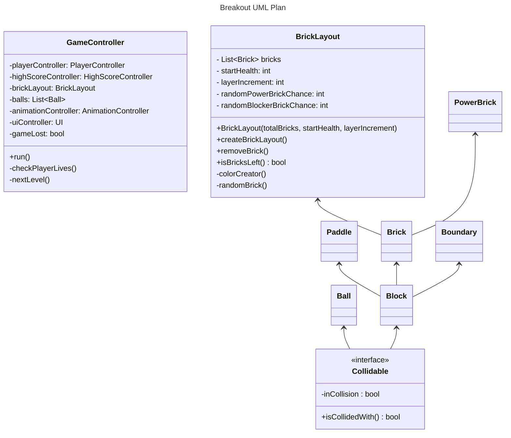
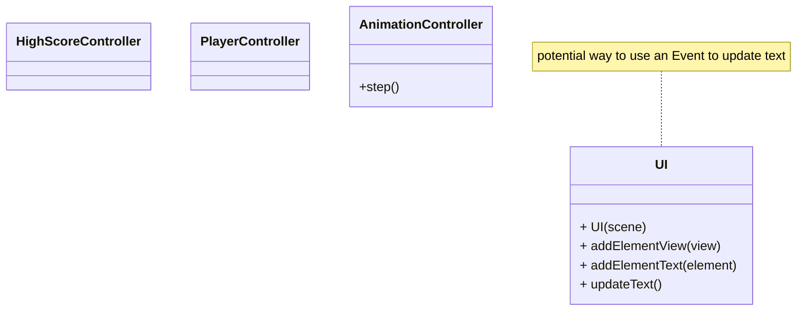

## Part 2 Plan
- Clean the animation controller/Main to follow clean code principles
- Move the brick layout functionality to its own class
- Manage collisions potentially through a "Collidable" interface
- Move the player movement management to the player controller
- Clean up paddle movement (remove jitter)
- Create a power up Brick

